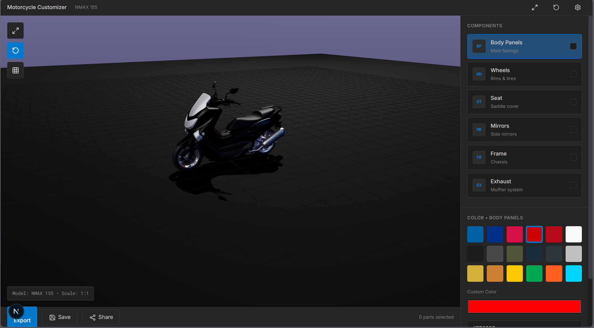

# MotoPH Professional Studio

> **3D Motorcycle Customization Platform** - Real-time color customization and e-commerce for Philippine motorcycle enthusiasts

[](https://nextjs.org/)
[](https://www.typescriptlang.org/)
[](https://threejs.org/)
[](https://opensource.org/licenses/MIT)

<div align="center">
  
</div>

---

## Features

### Real-Time 3D Customization
- **Interactive 3D Model** - Fully rotatable NMAX 155 motorcycle
- **Color Picker** - 22+ authentic motorcycle colors (Yamaha Blue, Honda Red, etc.)
- **Live Preview** - See changes instantly in professional studio lighting
- **Part Selection** - Customize body, wheels, seat, mirrors, frame independently

### E-Commerce Ready
- **Shopping Cart** - Add customized parts to cart
- **Real Parts Catalog** - Authentic brands (RCB Racing, Rizoma, Akrapovic)
- **Price Ranges** - ₱800 - ₱12,500 per part
- **Direct Checkout** - WhatsApp & Messenger integration with shops
- **Shop Locator** - Find certified installers near you

### Performance Indicators
- **Acceleration Impact** - See how parts affect speed (+1, +2, etc.)
- **Handling Metrics** - Track handling improvements
- **Weight Changes** - Monitor weight reduction (-1.5kg, -2.1kg)
- **Sound Levels** - Know what to expect (Quiet → Very Loud)

### Save & Share
- **Build Manager** - Save up to 10 custom builds locally
- **Share Links** - Share your design via URL
- **Export HD** - Download high-quality PNG screenshots
- **Before/After** - Compare stock vs custom instantly

### Professional Features
- **Compatibility Badges** - See which models parts fit
- **Installation Time** - Know how long each upgrade takes
- **Maintenance Tips** - Care instructions per part
- **Fitment Warnings** - Avoid incompatible combinations

---

## Tech Stack

### Frontend
- **Framework:** [Next.js 16](https://nextjs.org/) (App Router)
- **Language:** [TypeScript 5](https://www.typescriptlang.org/)
- **Styling:** [Tailwind CSS 3](https://tailwindcss.com/)
- **Icons:** [Lucide React](https://lucide.dev/)

### 3D Graphics
- **Engine:** [Three.js r160](https://threejs.org/)
- **Model Format:** GLTF/GLB
- **Lighting:** Professional studio setup (PBR materials)
- **Controls:** OrbitControls with auto-rotate

### Architecture
- **State Management:** React Hooks (useState, useEffect)
- **Custom Hooks:** `use3DScene`, `useColorState`, `useBuildManager`
- **Component Structure:** Modular & reusable
- **Type Safety:** Full TypeScript coverage

### DevOps
- **Container:** Docker (multi-stage builds)
- **CI/CD:** GitHub Actions
- **Deployment:** Vercel (recommended) / Docker
- **Version Control:** Git

---

## Installation

### Prerequisites
- Node.js 20+
- npm or yarn
- Git

### Quick Start

```bash
# Clone the repository
git clone https://github.com/ampolperlada/bike-blueprint
cd 3d-moto-sys

# Install dependencies
npm install

# Run development server
npm run dev

# Open browser
# Navigate to http://localhost:3000
```

### Using Docker

```bash
# Build image
docker build -t motoph:latest .

# Run container
docker run -p 3000:3000 motoph:latest

# Or use Docker Compose
docker-compose up
```

---

## Usage Examples

### Basic Customization
```typescript
// Select a part
setSelectedPart('body');

// Apply color
applyColor('body', '#0062A5'); // Yamaha Blue

// Save build
saveBuild(colors, selectedParts);
```

### Checkout Flow
```typescript
// User selects parts
selectedParts: ['body', 'wheels', 'exhaust']

// Opens checkout modal
<ShoppingCart 
  selectedParts={parts}
  totalPrice={22000}
  buildName="My Custom NMAX"
/>

// Sends to shop via WhatsApp/Messenger
```

---

## Project Structure

```
src/
├── app/
│   ├── page.tsx              # Main application
│   ├── layout.tsx            # Root layout
│   └── globals.css           # Global styles
│
├── components/
│   ├── 3d/
│   │   └── Scene3DViewer.tsx # Three.js scene
│   ├── customizer/
│   │   ├── ColorPicker.tsx   # Color selection
│   │   └── PartSelector.tsx  # Part buttons
│   ├── panels/
│   │   ├── PricingPanel.tsx  # Parts catalog
│   │   └── ShoppingCart.tsx  # Checkout flow
│   └── ui/
│       ├── Header.tsx        # Top navigation
│       └── ActionBar.tsx     # Bottom controls
│
├── hooks/
│   ├── use3DScene.ts         # Three.js logic
│   ├── useColorState.ts      # Color management
│   └── useBuildManager.ts    # Save/load builds
│
├── lib/
│   ├── constants/
│   │   ├── colors.ts         # Color presets
│   │   └── parts.ts          # Parts catalog
│   └── utils/
│       ├── performance.ts    # Calculations
│       ├── sharing.ts        # URL encoding
│       └── 3d-helpers.ts     # Three.js utils
│
└── types/
    ├── bike.ts               # Bike types
    └── parts.ts              # Part types
```

---

## Color System

### Brand Colors
- **Yamaha:** `#0062A5`, `#003087`, `#D31245`
- **Honda:** `#CC0000`, `#B50C18`, `#F8F8F8`

### Categories
- **Matte:** Black, Gray, Army Green, Navy Blue
- **Metallic:** Gunmetal, Silver, Gold, Bronze
- **Vibrant:** Racing Yellow, Kawasaki Green, Neon Orange
- **Classic:** White, Jet Black, Deep Red, Royal Blue

---

## Development

### Run Tests
```bash
npm run test
```

### Lint Code
```bash
npm run lint
```

### Type Check
```bash
npx tsc --noEmit
```

### Build for Production
```bash
npm run build
npm run start
```

---

## Deployment

### Deploy to Vercel (Recommended)
```bash
npm install -g vercel
vercel login
vercel --prod
```

### Deploy with Docker
```bash
# Build production image
docker build -t motoph:prod .

# Run
docker run -d -p 3000:3000 --name motoph motoph:prod
```

### Environment Variables
```env
NEXT_PUBLIC_APP_URL=https://yourdomain.com
NEXT_PUBLIC_ANALYTICS_ID=your_analytics_id
```

---

## Contributing

We welcome contributions! See our [Contributing Guide](CONTRIBUTING.md) for details.

### Ways to Contribute
- Report bugs
- Suggest features
- Improve documentation
- Add new color presets
- Add new bike models
- Translate to other languages

### Development Process
1. Fork the repository
2. Create a feature branch (`git checkout -b feature/amazing-feature`)
3. Commit changes (`git commit -m 'feat: add amazing feature'`)
4. Push to branch (`git push origin feature/amazing-feature`)
5. Open a Pull Request

---

## License

This project is licensed under the MIT License - see the [LICENSE](LICENSE) file for details.

---

## Acknowledgments

- **3D Model:** NMAX 155 from [Sketchfab](https://sketchfab.com/)
- **Inspiration:** Philippine motorcycle community
- **Icons:** [Lucide](https://lucide.dev/)
- **Hosting:** [Vercel](https://vercel.com/)

---

## Contact & Support

- **Issues:** [GitHub Issues](https://github.com/ampolperlada/3d-moto-sys/issues)
- **Discussions:** [GitHub Discussions](https://github.com/ampolperlada/3d-moto-sys/discussions)
- **Email:** christianp.perlada@gmail.com

---

## Roadmap

### Version 1.1 (Q2 2025)
- [ ] Add more bike models (Honda Click, Yamaha Mio)
- [ ] AR preview (view on your actual bike)
- [ ] Community builds gallery
- [ ] User accounts & profiles

### Version 2.0 (Q3 2025)
- [ ] Shop dashboard for partners
- [ ] Real-time inventory integration
- [ ] Payment processing
- [ ] Mobile app (React Native)

### Future Ideas
- [ ] AI-powered color suggestions
- [ ] Custom decals & graphics
- [ ] Virtual showroom
- [ ] 3D printing of parts

---

## Stats


---

<div align="center">
  <strong>built for filipino riders</strong>
  <br />
  <sub>made by <a href="https://github.com/ampolperlada">ampolperlada</a></sub>
</div>